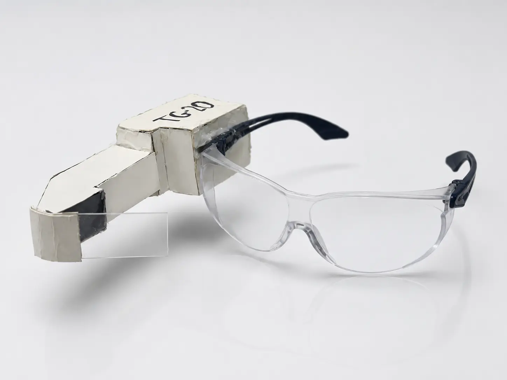

# TG-20 Smart Glasses

A responsive portfolio website documenting my electronics graduation project: smart glasses that display multimeter measurements directly in the user’s field of view.

[tg20-smart-glasses](https://tg20-smart-glasses.timpook11.chatgpt.site/)



## The project

TG-20 receives measurement data from an OWON B41T multimeter over BLE 4.0, decodes it with an Arduino Micro, and displays the result on a 128×64 OLED through a compact optical system.

## Built with

- Next.js, React and TypeScript
- Vinext and Cloudflare Workers
- Responsive RTL design
- Accessible image lightbox and mobile navigation

## Run locally

```bash
npm install
npm run dev
```

Requires Node.js 22.13 or newer.

---

Built by [Timothy Avidon](https://github.com/timavidon).
